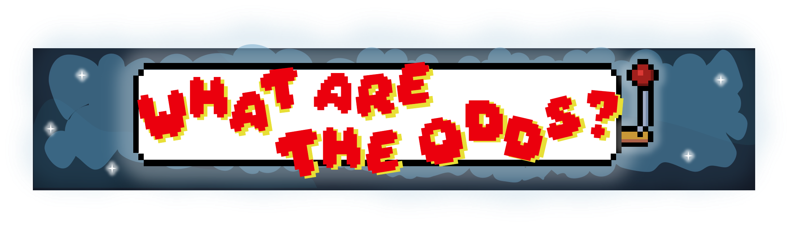

   

## ♦️ Table of Contents
 [1. Project Overview]  
 [2. Key Features]  
 [3. Technologies used]  
 [4. How it Contributes to UN’s SDG]  
 [5. Developers]  

 
 
 

## 🃏 Project Overview 
  What are the odds? is a collection of betting, luck, and logic games. It allows the user to make an account, top-up imaginary money, and test their luck by betting and playing the games. The games are separated into three kinds; Luck games which includes Lotto, Slot Machine, and Color Game; Card Games which includes Blackjack and Baccarat;  and a Logic game of Sudoku.
 
 
 

##  🎲 Key Features 

- **User Registration and Authentication**
  - What are the Odds offers a secure way of user authentication to access the casino.  
- **User Wallet | Top-up and Withdrawal**
  - This feature allows the user to top-top imaginary money to use in betting and playing games. With a withdrawal feature to access the imaginary money.  
- **Luck Games**
  - **Slot Machine** - A classic game of chance. The user will pay a price to ‘pull the lever’. A combination of three matching items would signify a jackpot, with a certain amount of money as prize.  
  - **Lotto** - A game of lottery. The user will pay a price for a ‘ticket’, and bet on a certain set of numbers. With difficulty levels that set the range of numbers to bet on. The computer will then pick a winning draw from the pool of numbers. Getting the correct draw would mean a jackpot for the user.  
  - **Color Game** - A traditional gambling game. The user would place a bet on six colors; red, blue, yellow, green, orange, and pink. A dice with different colors will be rolled. The colors picked by the dice are the winning colors. The player will receive a payout depending on the amount of colors they got right.  
- **Card Games**  
  - **Blackjack** - A popular casino card game. The game's objective is to have a hand value closer to 21 than the dealer's hand, without exceeding 21.  
  - **Baccarat** - A card game known for its simplicity. The goal is to bet on which hand will have a total value closest to 9. The game is usually played with multiple decks of cards and involves three possible bets: on the Player hand, the Banker hand, or a Tie. 
- **Logic Game**  
  - A classic game of Sudoku. The user would first bet on an amount. A game of sudoku would then start. The payout would then depend on the number of tries the player used to complete the puzzle. The amount of money the user bet would be multiplied by a certain amount. With a maximum of three tries. 
 
 

## ♣️ Technologies Used  
- **Programming Language**: C++
- **Console Interface**: Command-line Interaction
- **Database Management**: Storage using txt files (.txt)  

- <b>  **Libraries Used**: </b>   
  - **Standard Input/Output Library**: [iostream]
  - **String and Character Library**: [string], [cstring]
  - **File Input/Output**: [fstream], [sstream]
  - **Utility Library**: [cstdlib], [ctime]
  - **Mathematics and Numeric Limits Library**: [cmath], [limits]
  - **Containers and Algorithms**: [vector], [algorithm]
  - **Random Number Generation**: [random]
  - **Non-standard Library**: [conio.h]

##  🎰 How it Contributes to UN’s SDG 

- **SDG 3**: Good Health and Well-being  
  - The program is made to entertain, and satisfy your gaming needs. By using imaginary money, the program is made to promote responsible gaming and gambling. 
- **SDG 9**: Industry, Innovation, and Infrastructure  
  - The program serves as a technological innovation which also contributes in developing technological infrastructures.
- **SDG 10**: Reduced Inequalities  
  - What are the odds? is accessible to diverse groups and communities.
- **SDG 12**: Responsible Consumption and Production  
  - This casino would contribute to waste reduction and resource-efficient productions considering that the operations would be online. 
- **SDG 13**: Climate Action  
  - Adopt energy saving technologies and practices. Additionally, online practices can reduce manual casino operations.

##  <a id = "contrib"> 💰‍ Contributors </a>  
<table>
  <tr>
    <th>Name</th>
    <th>Email</th>
  </tr>
  <tr>
    <td>Africa, Kiarra Francesca Gabrielle </td>
    <td>>23-01292@g.batstate-u.edu.ph</td>
  </tr>
  <tr>
    <td>Lalu, Jerzha Ara Ramil C.</td>
    <td>23-05464@g.batstate-u.edu.ph</td>
  </tr>
  <tr>
    <td>Mallen, Jan Mayen D.</td>
    <td>>23-06548@g.batstate-u.edu.ph</td>
  </tr>
</table>

 

- Course:
  - CS 131 (Data Structures and Algorithm)
- Course Facilitator:
  - Fatima Marie Agdon
